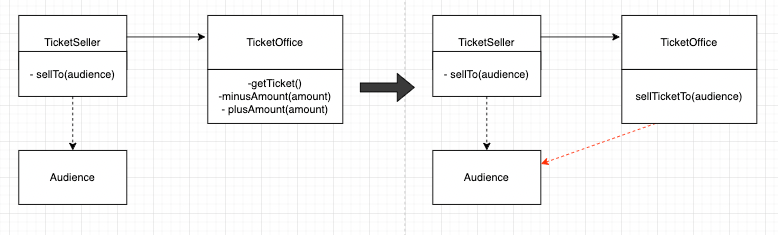

~~1장은 객체지향의 사실과 오해를 읽으면서 나왔던 얘기들이 요약정리 된 거 같았습니다.
따라서 1장을 읽으며 궁금했던 내용은 거의 없었습니다.

스터디원분들은 코드도 다들 너무 잘 이해 하셨을 것 같아서 따로 정리할 필요는 없다고 느껴졌습니다!! ( 가시성, 메소드 분리, 책임 이동,의존성 변화  등등등의 코드들)

먼저 생각해 볼 만하다고 느꼇던 것 하나와

전체적으로 반복된 내용만을 간략하게 적어보고자 합니다.

## page32 - 객체의자율성을 높일것인가 vs 결합도를 낮출 것인가(트레이드오프)

책의 예제 에서는 TicketOffice 의 “객체로서의 자율성" 을 높이기 위해 아래의 메소드 를 추가했다.

```java
public void sellToTicketTo(Audience audience) {
	this.plusAmount(audience.buy(getTicket()));
}
```

이 과정에서 Audience 에 대한 의존성이 추가되었다.



객체지향적 프로그래밍은

- 결합도를 낮추고 ( 최소한의 의존성을 남기고) 자율적이고 능동적인 개개체를 만드는 것이었다

그런데 위와 같은 상황은

- ***자율성을 높이는 과정에서, 의존성이 추가된 것***이다.

> 이런 트레이드 오프가 존재 할 수 있다.
>

책에서는 “결합도를 낮추는 것이 더 중요하다" 는 결론에 도달했다.

> 🤔 나의 생각은 어떤가?
>
>
> 나 역시 결합도를 낮추는 것이 더 중요하다고 생각된다. Office 로부터 직접 ticket 을 가져오는 등, Office 내부적인 것에 대해 Seller 가 잘 알고 있는 상황이 존재하긴 하지만, 어차피 Seller 에서는 Office 에 대한 의존성을 제거할 수 없다. 이는 객체간의 협력을 위해 필요한 최소한의 의존성이라고 생각되기 때문이다.
>
> 하지만, Office 를 좀 더 자율적인 객체로 만드는 과정에서, 추가적인 의존성이 생기는 것은 , 후에 Audience 에 대한 요구사항(or 다른 곳의 요구사항변경으로 인해 여기도 변경이 일어나야 할 떄 ) 변경이 생겨 Audience 의 코드 변경이 생기는 상황에서, 변경가능성이 존재하는 클래스가 추가되는 것이다.  그렇다면 우리는 Office 에서도 Audience 변경으로 인한 버그가 일어나는 것 아닌가? 하고 불안한 마음을 가져야 할 것이다..
>
> 따라서 나도 저자와 같이 의존성을 줄이는 방법을 택할 것 같다.
>
> (번외..)
>
> 사실 나는 메소드에 전달되는 객체에 대해서는 결합도를 크게 생각한 적이 없었다 🥲 … 생성자를 통해 객체가 주입되어, 이 객체를 갖고 있는 상황들만을 “의존성을 가진 상황" 이라고 생각하고 있었던 것 같다.
>
> 이와같이 메소드의 매개변수로 다른 객체를 전달받는 경우, 해당 메소드 내부에서는 이 객체를 사용하게 된다. 따라서 이 객체에 대한 의존성이 생기는 것임을.. 머리속에 계속 생각하자
>

# ch01 정리

## 절차 지향적 프로그래밍

절차지향적 프로그래밍은, ***데이터와 프로세스가 분리 되어***있다. 따라서 **“프로세스" 에서는 “각각의 데이터들에 직접 접근하여 사용"** 한다.

또한 **“프로세스에 모든 책임이 집중"** 되어 있다.

따라서, 데이터에 변경이 발생할 경우, 프로세스도 변경될 확률이 매우 높다.

객체지향적 프로그래밍은, 관련된 데이터와 프로세스를 묶는 것에서 시작한다.

## 객체지향적 프로그래밍

사실 이 객체지향 프로그래밍은 아주 단순하게 “프로세스와 데이터를 묶기만 하는 것" 이 아니다.

우리는 객체간의 협력을 하는 세계를 만들어야 하기 때문이다.  
객체간의 협력을 통해 어떤 기능을 구현하기 위해서는, 자율적이고 능동적인 객체의 모습이 될 수 있도록 해야 한다.

그런데 “프로세스와 데이터를 묶는 것 “ 이라는 말이 나오면, 어떤 이들은.. 아니 내가 그랬었는데 “데이터 중심으로" 객체를 설계 하려고 하기도 하는데 이런 접근법에 주의해야한다.
> “객체는 데이터 중심이 아닌, 책임 중심으로" 객체를 바라봐야 한다

( 책임이 너무 추상적이라면, 책임에 따른 역할, 행동. 이라고 생각하면 좋을 것이다)

이를 위해서는 “ 각 객체에게 적절한 책임을 할당" 하는 것이 필요하다.

이러한 관점은 현실세계를 바라보는 사람의 인지능력에서 따온 것이다. 물론 이 때도 너무 현실세계적인 관점으로 바라보면 모순적으로 보일 수 있다. 현실에서는 수동적 이어야 하는 객체가 능동적이고 자율적으로 행동하는게 어색해 보일 수도 있기 때문이다.

따라서 객체지향세계는 “의인화환 객체들이 살아숨쉬는..” 그런 세계로 바라보면 좋다

>  무엇을 얻나?

이를 통해 얻을 수 있는 것은

- **결합도가 낮고 && 응집도가 높은 객체들**
  - 최소한의 의존성은 남겨둬야 객체들간의 협력을 할 것이다. 다만 그 결합도가 매우 낮은 객체들을 만들 수 있어진다.
- 변경의 파급효과가 낮아진다. 요구사항은 항상 변경 될 수 있는 것이기 때문에 변경은 필연적이다. 요구사항 변경에 따라 코드 변경이 일어날 수 밖에 없다.

  객체지향적으로 잘 설계될 경우, 협력하는 객체 A - B 가 있다고 할 때, A 의 코드 변경이 일어나더라도 B 에는 변경이 일어나지 않게 된다 ( 잘 설계되었다면 ㅎㅎ; )

> 트레이드 오프가 존재한다

또한 객체지향적 설계과정에서도

위에서 언급 했던 것과 같은 트레이드 오프가 생길 수도 있다.

(그리고 이 트레이드 오프 외에도 성능적으로 단점이 되는 경우도 존재하기 때문에, 항상 객체지향적 설계를 모두 만족하는 코드를 짤 수는 없다고 생각된다)~~