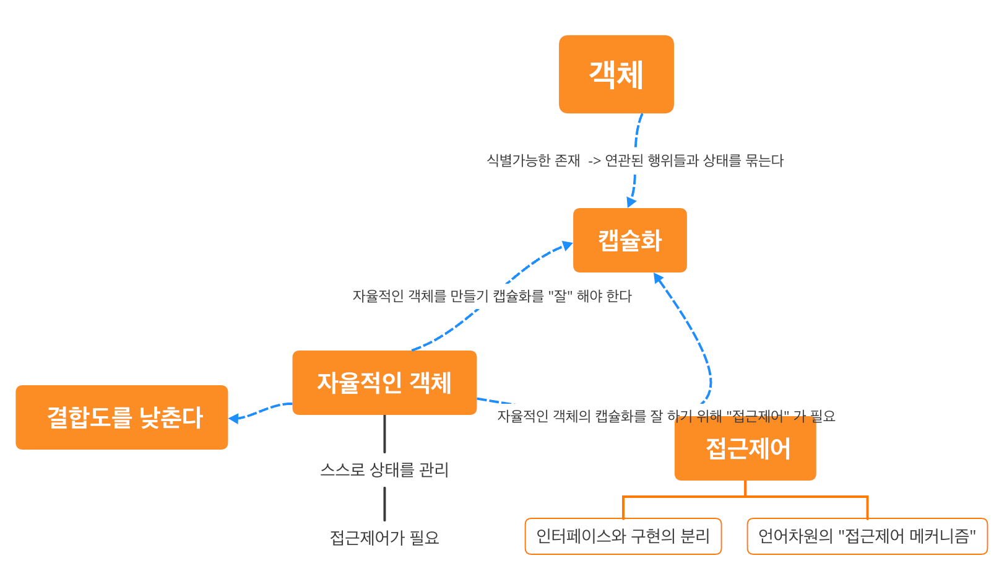

## 클래스가 아닌 “객체" 지향 / 유연하고 확장가능한 설계를 위해 객체는 섬이 아니라는 것을 생각하라

객체지향 프로그래밍을 떠올리면 “어떤 클래스를 만들지" 를 먼저 떠올리는 사람들이 많을 것이다.

하지만 객체지향 프로그래밍에서는 “객체"가 우선이다.

어떤 객체, 즉 “어떤 행동을 갖는 객체가 필요한지" 우선 생각해야 한다. (행동과 상태 중에서도 행동을 먼저 고려하는게 데이터 중심인 객체가 탄생하지 않도록 해 줄 것이다 )

이 때, 그 객체는 “섬" 이 아닌 “다른 객체들 과 협력하는 존재"로서 구상해야 한다. 그래야 유연하고, 확장가능한 설계가 가능해진다.

## 도메인의 구조를 반영하라

> _객체지향의 사실과 오해에서 나왔던 것 처럼, "도메인" 은 사람이 머리속으로 가지고 있는 "개념" 이기 때문에, 우리는 객체들의 구조가 "도메인의 개념들에서의 관계, 구조" 를 반영하도록 해야한다._ 
> 
> 는 것으로 이해했다.

프로그램을 사용해서 해결하려는 문제분야를 도메인이라 한다.

어떤 문제의 요구사항을 분석하면서 → 도메인을 구성하는 개념들을 객체로서 추상화하고 → 객체를 구현하는 것으로 볼 수 있다.

따라서 ***도메인을 구성하는 개념들이, 프로그램의 객체로 구현되는 것이라고*** 볼 수 있다.

그리고 이 객체들간의 관계는, 도메인의 개념들의 관계를 반영해야 한다. 그래야 사람들이 프로그램의 구조를 이해하고 예상하기 쉬워진다. ( 도메인이 일반적으로 사람들이 이해하고 있는 개념이기 때문에 …)

## 자율적인 객체

객체지향 프로그래밍에서 항상 나오는 말이 있다

> 객체는 자율적인 존재다
>

여기서 ***“자율적인 존재의 의미"*** 는 뭘까?  객체를 ***“자율적인 존재로 만들어주는 장치”*** 는 어떤 것들이 있을까?



먼저, 실세계 에서 객체를 떠올려 보면 **객체 라는 것은 “식별가능한 존재**"다. 따라서 우리는 **“어떤 연관된 행위들과 상태들을 묶어서 객체로 정의"** 한다.

이렇게 **“어떤 연관된 행위들과 상태들을 객체로 묶는 것" 을 “캡슐화"** 라고 부른다.

이 때, 우리는 **“자율적인 객체" 를 만들어 주기 위해 캡슐화 를 “잘” 해야** 한다.

자율적인 객체란 **“스스로 상태를 관리” 하고 “ 스스로 판단하여 행동"**하는 객체를 말한다. **이를 위해서는 “외부의 간섭을 최소화" 해야** 한다. 또한, 자율적인 객체들의 협력 관계에서의 **외부 객체는 “협력하는 객체를 믿고" 사용**한다.

이를 위해서는 ***“접근제어" 가 필요***하다.

접근 제어를 위한 장치로는 다음과 같은 것들이 존재한다.

- 인터페이스와 구현의 분리

  즉, **외부에서는 객체 내부 상태와 구현을 알 필요 없이, 공개된 퍼블릭 인터페이스만을 접근하도록** 하는 것이 좋을 것이다. 이는 **“인터페이스와 구현의 분리"라고도 불린다.**

- 언어차원에서의 접근 제어 메커니즘

  **언어차원에서 이를 지원**하기 위해 **“접근 제어 메커니즘"을 제공**하기도 한다. 이는 *자율적인 객체를 깨트리는 개발자의 **실수를 방지*** 해 줄 수 있다.


### 인터페이스와 구현의 분리

이를 통해 변경의 파급효과를 줄일 수 있다.

내부 구현을 변경하더라도, 인터페이스 사용자에는 영향을 끼치지 않을 수 있다.

> 객체 사이 의존성을 낮추는 방법 중 하나다.
>
> - 결합도 ↓

## 메시지와 메소드

- 메시지는 서로다른 객체 사이의 의사소통
- 메소드는 하나의 객체 내부에서의 의사소통

이라고 볼 수 있다.

# 코드를 살펴보자

## Long 대신 Money

- 돈과 ***관련된 로직들이 여기 저기 중복되는 것을 방지***

    ```java
    Long amount;
    
    // 지갑에서도
    private void plusAmount(long amount){
    	this.amount += amount;
    }
    // 티켓 판매소에서도
    private void sell(long amount) {
    	this.amount += amount;
    }
    ```

  Money 클래스를 둔다면? 중복코드 ( 돈을 증가시키는 연산작업) 를 제거할 수 있다.

    ```java
    // 지갑에서
    private void plusAmount(long amount) {
    	this.money.plusAmount(amount);
    }
    // 티켓 판매소에서
    private void sell(long amount) {
    	this.money.plusAmount(amount);
    }
    ```

- “돈"이라는 ***개념의 의미를 명시적으로 표현***할 수 있음.

## 왜 컨디션은 Interface 고 조건은 추상클래스지??🤔

디자인패턴을 공부해보면 “변경가능성" 을 고려 하라고 한다.

“변경 가능성이 있는 부분을 분리하라!” 라고 한다.

그리고 우리는 이 “분리” 한 부분에 대해서 변경가능성을 고려하여, public 하게 제공하는 부분과, 내부에 감추는 전략이 필요하다.

이를 위해서 Interface 와, 추상 메소드를 사용할 수 있다.

그런데 현재, 할인 정책은 “추상 클래스"로 Condition 은 인터페이스로 구현되어있다.

> 왜 하나는 추상클래스고, 조건은 인터페이스지?
>
> 둘 다 인터페이스로 하면 안됐던 걸까?🤔

이에 대해 한 번 생각 해 보았다. 
- 추상 클래스를 통해, 템플릿 패턴을 구현할 수 있다. 템플릿 패턴은 “부모 클래스에 공통적인 기본적인 알고리즘의 흐름을 구현" 하고, 변경되는 부분은 하위 클래스에 위임 하는 방식이다.
- 현재, “할인 정책" 클래스들은 “공통 로직과 상태들을” 갖고 있기 때문에, 템플릿 패턴을 통해, 중복 코드를 줄이면서도 확장 가능한 구조를 가질 수 있다.
- 반면, “Condition” 들은, 각각의 조건들이 매우 상이하다. 로직과 상태가 서로 매우 다르다. 
  - 따라서 이들을 동일한 타입으로 사용은 가능하되(다형성), 구현체에 따라 다른 조건 로직을 갖도록 하기위해서는 interface 가 적합해 보인다.